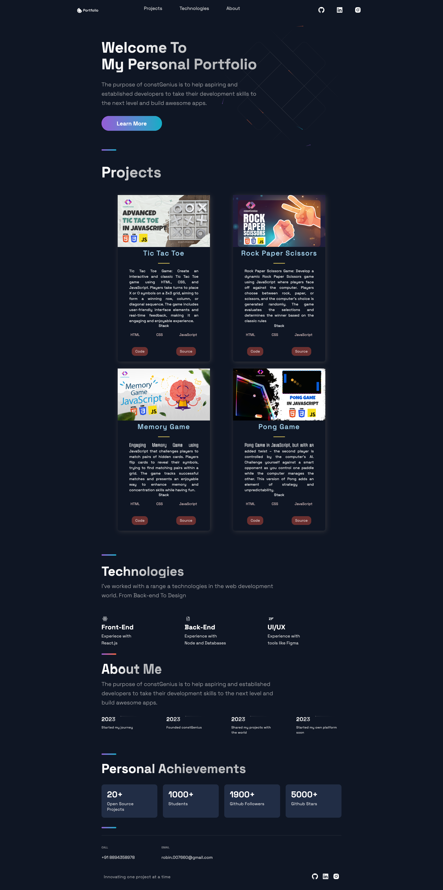

# Portfolio Website
Welcome to Portfolio website built using Next.js! This project showcases my skills, projects, and provides an overview of my professional journey.

Youtube Tutorial Link: https://youtu.be/9T-XtePdLOc

Live Preview: https://portfolio-website-theta-wine.vercel.app/ 



## Table of Contents

- [About](#about)
- [Features](#features)
- [Technologies Used](#technologies-used)
- [Getting Started](#getting-started)
- [Installation](#installation)
- [Usage](#usage)

## About

This portfolio website serves as a platform for me to display my work, skills, and experiences as a web developer. It provides an interactive and visually appealing way for visitors to learn more about me and the projects I've worked on.

## Features

- **Home:** A brief introduction and welcome message.
- **Projects:** Showcase of my featured projects with descriptions, screenshots, and links.
- **Skills:** List of technical skills and technologies I'm proficient in.
- **About Me:** A detailed section about my background, education, and professional journey.
- **Contact:** Information for visitors to reach out to me.

## Technologies Used

- Next.js: A React framework for building server-rendered applications.
- React: A JavaScript library for building user interfaces.
- CSS Modules: Scoped CSS for styling components.

## Getting Started

To get a local copy of this project up and running, follow these steps.

### Installation

1. Clone the repository: `git clone https://github.com/constgenius/Portfolio_Website`
2. Navigate to the project directory: `cd portfolio-website`
3. Install dependencies: `npm install`

### Usage

To start the development server and preview the website, run:

```bash
npm run dev
